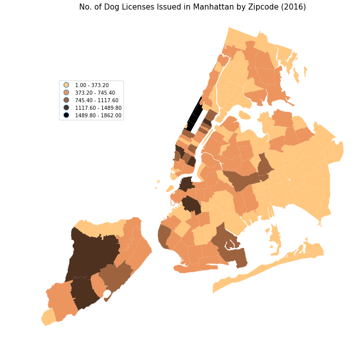

### Assignment 1
- Time Series Analysis on subway ridership
- Worked with Klo'e, Marvin, Qinyu, and Urwa for this assignment, couldn't complete it sigh

### Assignment 2
- Edited plot from homework 8 based on reviews

**Figure 1.**: Choropleth of the number of dog licenses issued in 2016 by zipcode. The darker the area, the higher the number of dog licenses issued to owners residing in the zipcodes. We can observe that the highest number of dog licenses are issued in Upper West Side, followed by the west side of Staten Island and Great Kills, DUMBO, Brooklyn Heights, Gowanus, Park Slope, and Upper East Side. Coney Island, east of Queens (around Jamaica), and the Bronx seem to have the lowest number of dog licenses issued.