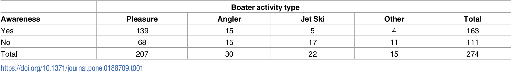
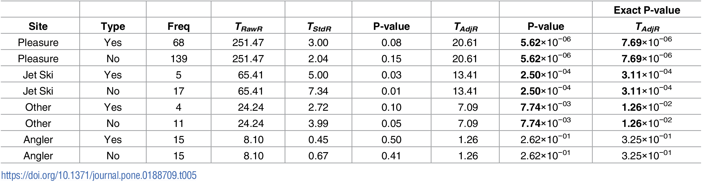

# Assignment 2

| **Statistical Analyses**	|  **IV(s)**  |  **IV type(s)** |  **DV(s)**  |  **DV type(s)**  |  **Control Var** | **Control Var type**  | **Question to be answered** | **_H0_** | **alpha** | **link to paper**| 
|:----------:|:----------|:------------|:-------------|:-------------|:------------|:------------- |:------------------|:----:|:-------:|:-------|
chisquared test | 1, awareness of zebra mussels (yes or no) | categorical | 1, boatriding activity type (pleasure, angler, jet ski, other)| categorical | location: lake mead | discrete | investigate whether boating activity type and awareness of zebra mussels are independent | boating activity and awareness of zebra mussels are independent | 0.05 | [Fisher’s exact approach for post hoc analysis of a chi-squared test](https://journals.plos.org/plosone/article?id=10.1371/journal.pone.0188709) |
correlation | 19, Volume of subcortical structures: CC Ant, CC Ant/Mid, CC Mid, CC Post/Mid, CC Post, L/R Caudate, L/R Putamen, L/R Pallidum, L/R Accumb, L/R Thalamus, L/R Hippo, L/R Amygdala | continuous | 5, total score of each aptitude measure (vocabulary, math, foresight, paper folding, inductive reasoning) | discrete | 2, age and sex | continuous and categorical | are subcortinal volumes and aptitude correlated? | there is no correlation between subcortical structure volumes and better performance across all measures of aptitude | 0.05 | [Subcortical Correlates of Individual Differences in Aptitude](https://journals.plos.org/plosone/article?id=10.1371/journal.pone.0089425) |
logistic regression	| 27, age, race, employment status, oral contraceptive use, age at menopause, no. of pregnancies, post menopausal hormone theraphy, smoking status, sleep disturbance, depression, presence of lifetime sex partner, physical activity, weight change in past two years, BMI at 35 y/o, 10lb loss in weight or more in past 20 years, cancer, diabetes, hypertension, cardiovascular disease, METs at baseline, total calories, dietary alcohol, dietary fiber, % calories from SFA, % calories from MFA, % calories from PFA | ordinal, dichotomous, categorical | 1, weight gain of 3% or more (yes or no)| categorical | 3, age group (50-79), post-menopausal, plan to live in area of clinic for at least 3 years | categorical | What variables lead to higher risk of weight gain among menopausal women | CART analysis results and recorded results are not from the same population   | 0.05 | [Risk Profiles for Weight Gain among Postmenopausal Women](https://journals.plos.org/plosone/article?id=10.1371/journal.pone.0121430) |

## Chi-Square

## Correlation

## Logistic Regression

