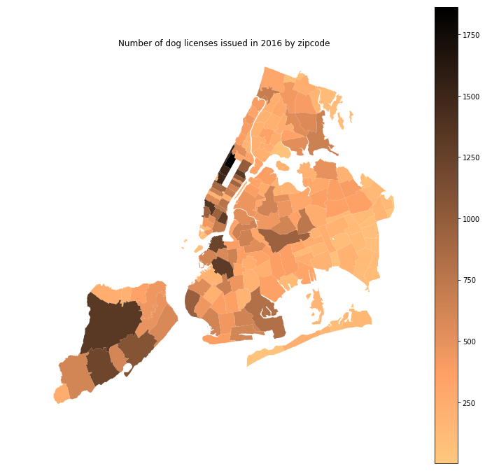

## Assignment 1

Choropleth of the number of dog licenses issued in 2016 by zipcode. The darker the area, the higher the number of dog licenses issued to owners residing in the zipcodes. 

## Assignment 2
https://www.authorea.com/users/249612/articles/335954-citibike-miniproject-report
