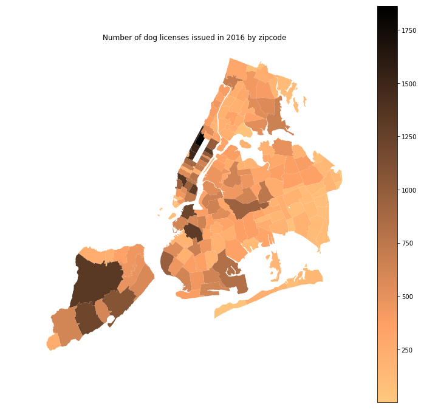

**Caption**: Choropleth of the number of dog licenses issued in 2016 by zipcode. The darker the area, the higher the number of dog licenses issued to owners residing in the zipcodes.

**Eve's Review**: 
The plot is easy to read. It’s clear that the choropleth is showing the number of dog licenses issued by zipcode in NYC, with darker shades signifying a higher number of licenses issued. The esthetic is functional to what the plot is communicating. A sequential color palette is used, which is the correct choice for this plot. It shows that data range from low values to high values without distracting the viewer with large hue shifts. The plot honestly reproduces the data without deforming it. My recommendation to improve the plot is to provide more information in the caption and title. Although it’s clear based on the shape of the map, it’s not stated anywhere that the plot is showing dog licenses issued in NYC. The caption should also comment on notable elements from the plot – for example, that the most dog licenses are issued in Staten Island, the upper west side of Manhattan, DUMBO, Brooklyn Heights, Gowanus, and Park Slope.  